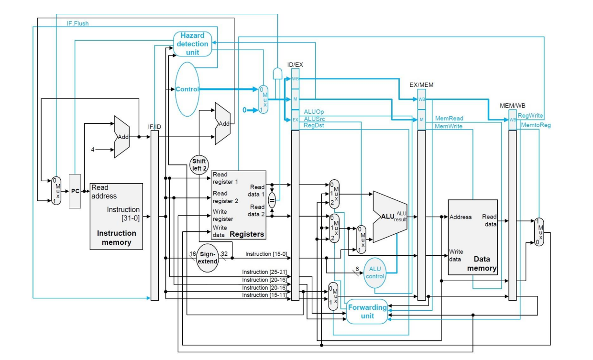
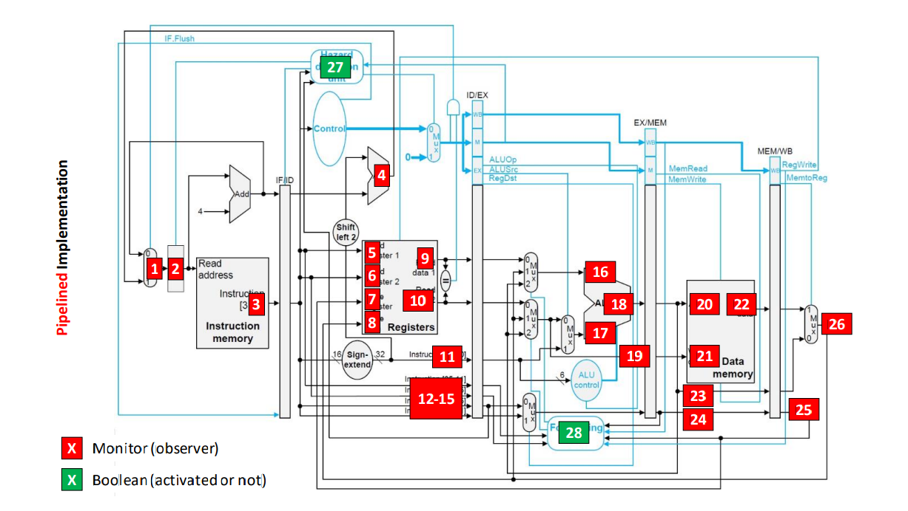

# MIPS32 Pipeline Processor Simulator

This project is a MIPS32 processor simulator implemented in a high-level programming language. The simulator is capable of executing programs written in MIPS32 assembly language with cycle-accurate precision. The processor implements a pipelined data path, as shown in the diagram below:



The goal of this project was to implement the entire data path and control unit of the pipelined MIPS32 processor,including the Hazard Detection Unit and Forwarding Unit.

The project succefully implements the entire data path and control unit pipelined processor has a Hazard Detection Unit and Forwarding Unit. The simulator can incorporate these units to provide full functionality.

## Supported Instructions

The implemented processor supports a subset of the MIPS32 Instruction Set Architecture (ISA). The supported instructions are listed below:

1. add
2. addi
3. sub
4. and
5. or
6. xor
7. nor
8. slt
9. lw
10. sw
11. beq
12. bne
13. addiu
14. j
15. jal
16. jr
17. lui
18. sll
19. srl
20. sra
21. slti
22. sltu

Please note that the instructions j, jal, jr, and lui are ignored.

## Simulation Functionality and Inputs/Outputs

The simulator has the following functionality:

1. Accept an input file containing MIPS32 assembly code.
2. Execute each instruction sequentially, cycle by cycle.
3. Update the register file and main memory at the end of each cycle.
4. Print the values of specified monitor signals in each cycle, as shown in the diagram below:



5. Additionally, for specific cycles, print the instruction in each pipeline stage (IF, ID, EX, MEM, WB). If there is a bubble in a stage, indicate it as "Bubble".
6. At the end of execution, generate an output file containing:
    - The contents of the register file, main memory, and monitor signals at specific clock cycles.
    - The instructions in each pipeline stage for the specified cycles.
    - The final contents of the register file and main memory.

Please refer to the provided diagrams and notes for more details on the simulation functionality and the format of the output file.

## Notes

- Monitors 27 and 28 in the diagram are specific to Exercise 4 and should be implemented. For Exercise 3, implement all other monitors except for 27 and 28.
- Monitors 27 and 28 are Boolean and can have values of either 0 or 1. For example, if the Hazard Detection Unit does not detect any hazards in a particular cycle, monitor 27 should indicate "Disabled".
- Register $gp (R28) should be initialized to the value 0x10008000, and register $sp (R29) to the value 0x7ffffffc.
- All the details of the data path and control unit of the pipelined MIPS32 processor are described in the provided notes.

## Usage

1. Clone or download the project repository.
2. Compile and run the MIPS32 processor simulator using `g++ -std=gnu++17 sim.cpp ./instruction/instruction.cpp ./Mips32/Mips32.cpp ./register_file/register_file.cpp ./label_struct/label_struct.cpp ./parser/parser.cpp ./assembler/assembler.cpp -o simulator.exe
`.
3. Provide an input file containing MIPS32 assembly code.
4. Run the simulator `.\simulator.exe .\InputFilename.s ./OutputFileName.txt`
4. Review the output file generated by the simulator for the register file, main memory, monitor signals, and pipeline stage instructions.

## Input and Output example
### Input
```assembly
.data
.text

main:

	ori $v0, $zero, 0x1
	ori $v1, $zero, 0x2
	ori $a0, $zero, 0x3
	ori $a1, $zero, 0x4
	ori $a2, $zero, 0x5
	ori $a3, $zero, 0x6
	ori $t0, $zero, 0x0
```
### Output

```plaintext
-----Cycle 1-----
Registers:
0	0	0	0	0	0	0	0	0	0	0	0	0	0	0	0	0	0	0	0	0	0	0	0	0	0	0	0	0	10008000	7ffffffc	0	0

Monitors:
4	0	ori $v0, $zero, 0x1	-	-	-	-	-	-	-	-	-	-	-	-	-	-	-	-	-	-	-	-	-	-	-	0	0

Memory State:

Pipeline Stages:
ori $v0, $zero, 0x1

-----Cycle 2-----
Registers:
4	0	0	0	0	0	0	0	0	0	0	0	0	0	0	0	0	0	0	0	0	0	0	0	0	0	0	0	0	10008000	7ffffffc	0	0

Monitors:
8	4	ori $v1, $zero, 0x2	-	$zero	-	-	-	0	-	1	$zero	-	$v0	-	-	-	-	-	-	-	-	-	-	-	-	0	0

Memory State:

Pipeline Stages:
ori $v1, $zero, 0x2	ori $v0, $zero, 0x1

-----Cycle 3-----
Registers:
8	0	0	0	0	0	0	0	0	0	0	0	0	0	0	0	0	0	0	0	0	0	0	0	0	0	0	0	0	10008000	7ffffffc	0	0

Monitors:
c	8	ori $a0, $zero, 0x3	-	$zero	-	-	-	0	-	2	$zero	-	$v1	-	0	1	1	-	-	-	-	-	-	-	-	0	0

Memory State:

Pipeline Stages:
ori $a0, $zero, 0x3	ori $v1, $zero, 0x2	ori $v0, $zero, 0x1

-----Cycle 4-----
Registers:
c	0	0	0	0	0	0	0	0	0	0	0	0	0	0	0	0	0	0	0	0	0	0	0	0	0	0	0	0	10008000	7ffffffc	0	0

Monitors:
10	c	ori $a1, $zero, 0x4	-	$zero	-	-	-	0	-	3	$zero	-	$a0	-	0	2	2	-	-	-	-	1	$v0	-	-	0	0

Memory State:

Pipeline Stages:
ori $a1, $zero, 0x4	ori $a0, $zero, 0x3	ori $v1, $zero, 0x2	ori $v0, $zero, 0x1

-----Cycle 5-----
Registers:
10	0	0	1	0	0	0	0	0	0	0	0	0	0	0	0	0	0	0	0	0	0	0	0	0	0	0	0	0	10008000	7ffffffc	0	0

Monitors:
14	10	ori $a2, $zero, 0x5	-	$zero	-	$v0	1	0	-	4	$zero	-	$a1	-	0	3	3	-	-	-	-	2	$v1	$v0	1	0	0

Memory State:

Pipeline Stages:
ori $a2, $zero, 0x5	ori $a1, $zero, 0x4	ori $a0, $zero, 0x3	ori $v1, $zero, 0x2	ori $v0, $zero, 0x1

-----Cycle 6-----
Registers:
14	0	0	1	2	0	0	0	0	0	0	0	0	0	0	0	0	0	0	0	0	0	0	0	0	0	0	0	0	10008000	7ffffffc	0	0

Monitors:
18	14	ori $a3, $zero, 0x6	-	$zero	-	$v1	2	0	-	5	$zero	-	$a2	-	0	4	4	-	-	-	-	3	$a0	$v1	2	0	0

Memory State:

Pipeline Stages:
ori $a3, $zero, 0x6	ori $a2, $zero, 0x5	ori $a1, $zero, 0x4	ori $a0, $zero, 0x3	ori $v1, $zero, 0x2

-----Cycle 7-----
Registers:
18	0	0	1	2	3	0	0	0	0	0	0	0	0	0	0	0	0	0	0	0	0	0	0	0	0	0	0	0	10008000	7ffffffc	0	0

Monitors:
1c	18	ori $t0, $zero, 0x0	-	$zero	-	$a0	3	0	-	6	$zero	-	$a3	-	0	5	5	-	-	-	-	4	$a1	$a0	3	0	0

Memory State:

Pipeline Stages:
ori $t0, $zero, 0x0	ori $a3, $zero, 0x6	ori $a2, $zero, 0x5	ori $a1, $zero, 0x4	ori $a0, $zero, 0x3

-----Cycle 8-----
Registers:
1c	0	0	1	2	3	4	0	0	0	0	0	0	0	0	0	0	0	0	0	0	0	0	0	0	0	0	0	0	10008000	7ffffffc	0	0

Monitors:
20	1c	ori $t1, $zero, 0x1	-	$zero	-	$a1	4	0	-	0	$zero	-	$t0	-	0	6	6	-	-	-	-	5	$a2	$a1	4	0	0

Memory State:

Pipeline Stages:
ori $t1, $zero, 0x1	ori $t0, $zero, 0x0	ori $a3, $zero, 0x6	ori $a2, $zero, 0x5	ori $a1, $zero, 0x4

-----Cycle 9-----
Registers:
20	0	0	1	2	3	4	5	0	0	0	0	0	0	0	0	0	0	0	0	0	0	0	0	0	0	0	0	0	10008000	7ffffffc	0	0

Monitors:
24	20	ori $t2, $zero, 0x2	-	$zero	-	$a2	5	0	-	1	$zero	-	$t1	-	0	0	0	-	-	-	-	6	$a3	$a2	5	0	0

Memory State:

Pipeline Stages:
ori $t2, $zero, 0x2	ori $t1, $zero, 0x1	ori $t0, $zero, 0x0	ori $a3, $zero, 0x6	ori $a2, $zero, 0x5

-----Cycle 10-----
Registers:
24	0	0	1	2	3	4	5	6	0	0	0	0	0	0	0	0	0	0	0	0	0	0	0	0	0	0	0	0	10008000	7ffffffc	0	0

Monitors:
28	24	ori $t3, $zero, 0x3	-	$zero	-	$a3	6	0	-	2	$zero	-	$t2	-	0	1	1	-	-	-	-	0	$t0	$a3	6	0	0

Memory State:

Pipeline Stages:
ori $t3, $zero, 0x3	ori $t2, $zero, 0x2	ori $t1, $zero, 0x1	ori $t0, $zero, 0x0	ori $a3, $zero, 0x6

 ```
